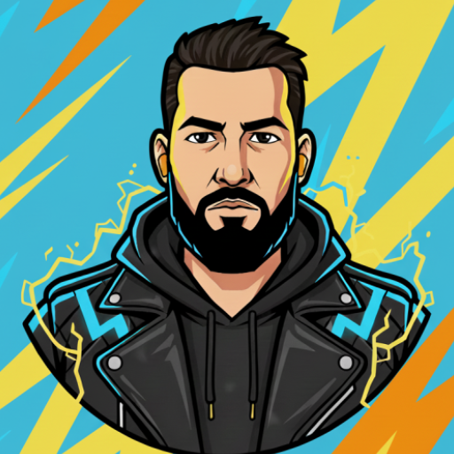

# RaiForm

<p align="center">
  
</p>

<p align="center">
  <b>The modern fitness coaching companion for Android.</b>
</p>

<p align="center">
  <a href="https://kotlinlang.org/"></a>
  <a href="https://developer.android.com/jetpack/compose"></a>
  <a href="https://firebase.google.com/"></a>
  <a href="https://developer.android.com/training/dependency-injection/hilt-android"></a>
</p>

## 📋 Overview

RaiForm is a robust client management and workout tracking application designed for fitness coaches. It allows for seamless scheduling, tracking of client progress, and visualizing workout history.

Built with a **Modern Android Architecture**, it features an "Offline-First" approach using Room Database synchronized with Cloud Firestore, ensuring data is always available and safe.

## ✨ Key Features

*   **⚡ Smart Import:** Parse raw text notes (e.g., from Google Keep) into structured Client and Session data using intelligent regex parsing.
*   **📅 Dartboard Scheduler:** A unique, custom 24-hour circular clock UI for intuitive weekly planning.
*   **📊 Progress Tracking:** Visualize volume, reps, and track Personal Bests (PBs) over time with interactive charts.
*   **🔄 Weekly Resets:** Automated background workers (WorkManager) handle weekly schedule resets and history logging, ensuring fresh sessions for the new week.
*   **📱 Home Screen Widget:** Built with **Jetpack Glance**, providing quick access to the day's schedule right from the home screen.
*   **☁️ Offline-First Sync:** Full functionality without internet. Data syncs to Firebase Firestore when connection is restored.

## 🛠️ Tech Stack

*   **Language:** Kotlin
*   **UI:** Jetpack Compose (Material 3) + Edge-to-Edge
*   **Navigation:** Type-Safe Compose Navigation
*   **Dependency Injection:** Dagger Hilt
*   **Local Database:** Room (SQLite)
*   **Remote Backend:** Firebase (Firestore, Auth, Analytics)
*   **Background Work:** WorkManager
*   **Widgets:** Jetpack Glance
*   **Build System:** Gradle Version Catalogs (`libs.versions.toml`)

## 🏗️ Architecture

The app follows **Clean Architecture** principles with a distinct separation of concerns:

1.  **Domain Layer:** Pure Kotlin models and Use Cases (e.g., `WeeklyResetUseCase`, `ImportLegacyNoteUseCase`).
2.  **Data Layer:** Repository pattern mediating between Local (Room) and Remote (Firestore) data sources.
3.  **UI Layer:** MVVM pattern with `ViewModel` and Compose screens.

## 🚀 Getting Started

### Prerequisites
*   Android Studio Ladybug or newer (Support for Kotlin 2.1.0).
*   JDK 17.

### Firebase Setup
This project uses Firebase. To build it successfully, you must add your own configuration:

1.  Create a project in the [Firebase Console](https://console.firebase.google.com/).
2.  Add an Android App with package: `uk.co.fireburn.raiform`.
3.  Download `google-services.json`.
4.  Place the file in `app/google-services.json`.

### Building
```bash
# Clean and Build Debug APK
./gradlew clean assembleDebug
```

## 🎨 Resources & Design

The app utilizes a custom "Zeraora" inspired theme (Electric Yellow / Slate Black).

 

*Icons and resources follow standard Android adaptive icon guidelines:*
*   **AnyDPI:** `app/src/main/res/mipmap-anydpi-v26/`
*   **Values:** `app/src/main/res/values/` (Strings, Themes)

## 📄 License

This project is licensed under the **GNU General Public License v3.0** (or later).
See the [LICENSE](LICENSE) file for details.

Created by Mike Lothian
